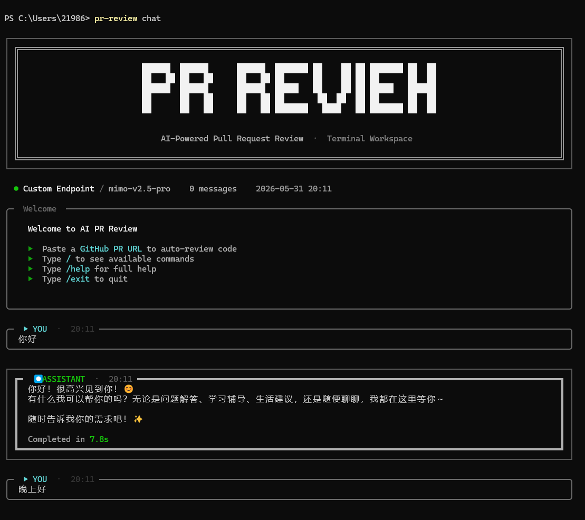
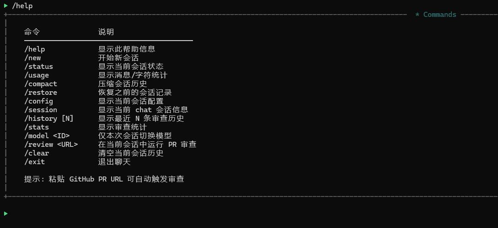
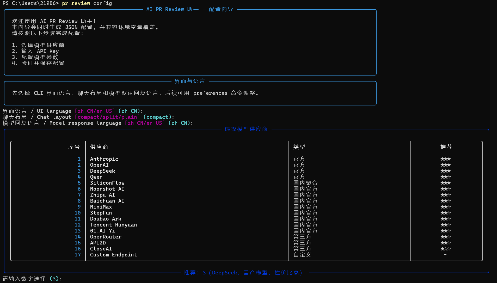

# AI PR Review Assistant

> AI 驱动的 GitHub Pull Request 代码审查 CLI 工具

[](https://www.python.org/)
[](LICENSE)
[]()
[]()

🌐 **[在线演示](https://jianglai999.github.io/AI-PR-Review-Assistant-web/)** | 📖 **[完整文档](docs/PROJECT_DESIGN.md)** | 💡 **[创新点](docs/INNOVATION.md)**

---

## 项目简介

AI PR Review Assistant 是一个基于 AI 的代码审查工具，通过智能分析 GitHub Pull Request 变更，自动发现潜在问题，帮助开发者提升代码审查效率与质量。

### 核心特性

- 🤖 **多模型支持** — 支持 18+ 模型供应商（OpenAI、Anthropic、DeepSeek、Qwen 等）
- 🎯 **智能过滤** — 自动跳过测试、文档、配置等不相关文件
- 📊 **结构化输出** — 终端彩色、Markdown、JSON、GitHub PR 评论
- 💰 **成本控制** — 单次运行和 24 小时窗口双重预算限制
- 💬 **聊天工作区** — 交互式终端聊天，支持斜杠命令
- 📦 **一键安装** — pipx / pip / curl 多种安装方式

---

## 项目截图

### 配置向导



### PR 审查输出



### 聊天工作区



---

## 快速开始

### 安装

```bash
# 方式 1：pipx 安装（推荐）
pipx install ai-pr-review

# 方式 2：pip 安装
pip install ai-pr-review

# 方式 3：一行命令安装（Linux/macOS）
curl -fsSL https://raw.githubusercontent.com/JiangLai999/AI-PR-Review-Assistant/main/install.sh | sh

# 方式 4：一行命令安装（Windows PowerShell）
irm https://raw.githubusercontent.com/JiangLai999/AI-PR-Review-Assistant/main/install.ps1 | iex

# 方式 5：从 GitHub 安装
pipx install "git+https://github.com/JiangLai999/AI-PR-Review-Assistant.git"

# 方式 6：从源码安装
git clone https://github.com/JiangLai999/AI-PR-Review-Assistant.git
cd AI-PR-Review-Assistant
pip install -e .
```

### 配置

```bash
# 启动交互式配置向导
pr-review config

# 快速配置
pr-review config --quick

# 查看当前配置
pr-review config show

# 测试配置有效性
pr-review config test

# 检查供应商健康状态
pr-review config health

# 发现可用模型
pr-review config models

# 切换默认模型
pr-review config model --name "模型名称"
```

### 使用

```bash
# 审查 PR
pr-review https://github.com/owner/repo/pull/123

# 指定模型审查
pr-review https://github.com/owner/repo/pull/123 --model gpt-4

# 输出为 Markdown 文件
pr-review https://github.com/owner/repo/pull/123 --format markdown --output report.md

# 发布为 GitHub PR 评论
pr-review https://github.com/owner/repo/pull/123 --publish-comment

# 干运行（不调用 AI）
pr-review https://github.com/owner/repo/pull/123 --dry-run

# 查看历史记录
pr-review history

# 查看统计信息
pr-review stats
```

---

## 审查流水线

```
PR URL
  │
  ▼
┌──────────────┐    ┌──────────────┐    ┌──────────────┐
│  PR Fetcher  │───▶│    Filter    │───▶│   Context    │
│  获取 PR 数据 │    │  智能过滤    │    │  构建上下文  │
└──────────────┘    └──────────────┘    └──────────────┘
                                               │
                                               ▼
┌──────────────┐    ┌──────────────┐    ┌──────────────┐
│    Post      │◀───│  AI Client   │◀───│   Prompt     │
│  Processor   │    │  调用 AI 模型 │    │  组装 Prompt │
└──────────────┘    └──────────────┘    └──────────────┘
       │
       ▼
┌──────────────┐    ┌──────────────┐
│ Result Store │    │   Report     │
│  持久化存储   │    │  渲染报告    │
└──────────────┘    └──────────────┘
```

---

## Chat 工作区

```bash
# 进入聊天模式
pr-review chat

# 单条消息
pr-review chat --message "帮我总结这个 PR 的审查重点"

# 临时切换模型
pr-review chat --model "gpt-4" --message "你好"
```

### 斜杠命令

| 命令 | 说明 |
|------|------|
| `/help` | 显示帮助信息 |
| `/status` | 显示会话状态 |
| `/usage` | 显示消息统计 |
| `/model <ID>` | 切换模型 |
| `/review <URL>` | 执行 PR 审查 |
| `/history` | 查看审查历史 |
| `/stats` | 查看统计数据 |
| `/compact` | 压缩会话历史 |
| `/restore` | 恢复历史会话 |
| `/clear` | 清空当前会话 |
| `/exit` | 退出聊天 |

---

## 配置文件

配置文件位置：`~/.ai_pr_review/config.json`

```json
{
  "provider": {
    "name": "custom",
    "display_name": "Custom Endpoint",
    "api_key": "sk-xxx",
    "base_url": "https://api.example.com/v1",
    "api_format": "openai",
    "default_model": "model-name"
  },
  "github_token": "ghp_xxx",
  "preferences": {
    "output_format": "terminal",
    "language": "zh-CN"
  },
  "ai_client": {
    "max_cost_per_run": 5.0,
    "max_cost_per_24h": 50.0
  }
}
```

### 配置优先级

1. CLI 参数 `--config <path>`
2. 环境变量 `AI_PR_REVIEW_*`
3. 用户级配置 `~/.ai_pr_review/config.json`
4. 项目级配置 `.ai_pr_review/config.json`
5. 项目本地配置 `.ai_pr_review/config.local.json`

---

## 支持的模型供应商

| 供应商 | API 格式 | 说明 |
|--------|----------|------|
| OpenAI | openai | GPT 系列模型 |
| Anthropic | anthropic | Claude 系列模型 |
| DeepSeek | openai | DeepSeek 系列模型 |
| Qwen | openai | 通义千问系列 |
| SiliconFlow | openai | 硅基流动 |
| Moonshot | openai | 月之暗面 |
| Zhipu | openai | 智谱 AI |
| Baichuan | openai | 百川智能 |
| Minimax | openai | MiniMax |
| Stepfun | openai | 阶跃星辰 |
| Doubao | openai | 豆包 |
| Hunyuan | openai | 混元 |
| Yi | openai | 零一万物 |
| OpenRouter | openai | 多模型代理 |
| API2D | openai | 第三方代理 |
| CloseAI | openai | 第三方代理 |
| OhMyGPT | openai | 第三方代理 |
| Custom | openai | 自定义端点 |

---

## 技术栈

| 技术 | 用途 |
|------|------|
| Python 3.12+ | 主语言 |
| Click | CLI 框架 |
| Rich | 终端 UI |
| Pydantic | 数据验证 |
| PyGithub | GitHub API |
| Anthropic SDK | AI 模型调用 |
| tree-sitter | AST 解析（可选） |
| SQLite | 本地存储 |
| GSAP | 前端动画 |

---

## 项目结构

```
AI-PR-Review-Assistant/
├── src/ai_pr_review/
│   ├── cli.py                    # CLI 入口
│   ├── config.py                 # 配置管理
│   ├── config_wizard.py          # 配置向导
│   ├── chat_commands.py          # 聊天命令
│   ├── chat_runtime.py           # 聊天引擎
│   ├── models/
│   │   └── pr_data.py            # 数据模型
│   ├── services/
│   │   ├── pr_fetcher.py         # PR 获取
│   │   ├── filter_pipeline.py    # 文件过滤
│   │   ├── context_builder.py    # 上下文构建
│   │   ├── prompt_assembler.py   # Prompt 组装
│   │   ├── ai_client.py          # AI 调用
│   │   ├── post_processor.py     # 后处理
│   │   ├── report_renderer.py    # 报告渲染
│   │   ├── result_store.py       # 结果存储
│   │   ├── review_orchestrator.py# 编排层
│   │   ├── cost_controller.py    # 成本控制
│   │   └── model_providers/      # 多供应商适配
│   └── utils/
│       └── github_url_parser.py  # URL 解析
├── tests/                        # 测试套件 (175 tests)
├── docs/                         # 文档
│   ├── PROJECT_DESIGN.md         # 项目设计书
│   ├── INNOVATION.md             # 创新点文档
│   ├── API.md                    # API 文档
│   └── WEBSITE.md                # 前端展示文档
├── website/                      # 前端展示页面
│   ├── index.html
│   ├── css/style.css
│   └── js/main.js
├── pyproject.toml                # 包配置
├── README.md                     # 本文件
├── CHANGELOG.md                  # 变更日志
├── CONTRIBUTING.md               # 贡献指南
└── LICENSE                       # MIT 许可证
```

---

## 测试与质量

```bash
# 运行测试
pytest

# 代码格式化检查
black --check src tests

# 导入排序检查
isort --check-only src tests

# 类型检查
mypy src
```

### 测试覆盖率

| 模块 | 测试数 | 覆盖率 |
|------|--------|--------|
| CLI | 54 | 85% |
| PR Fetcher | 48 | 87% |
| Filter Pipeline | 14 | 96% |
| Context Builder | 5 | 94% |
| Prompt Assembler | 6 | 95% |
| AI Client | 12 | 77% |
| Post Processor | 5 | 100% |
| Cost Controller | 6 | 93% |
| Result Store | 6 
