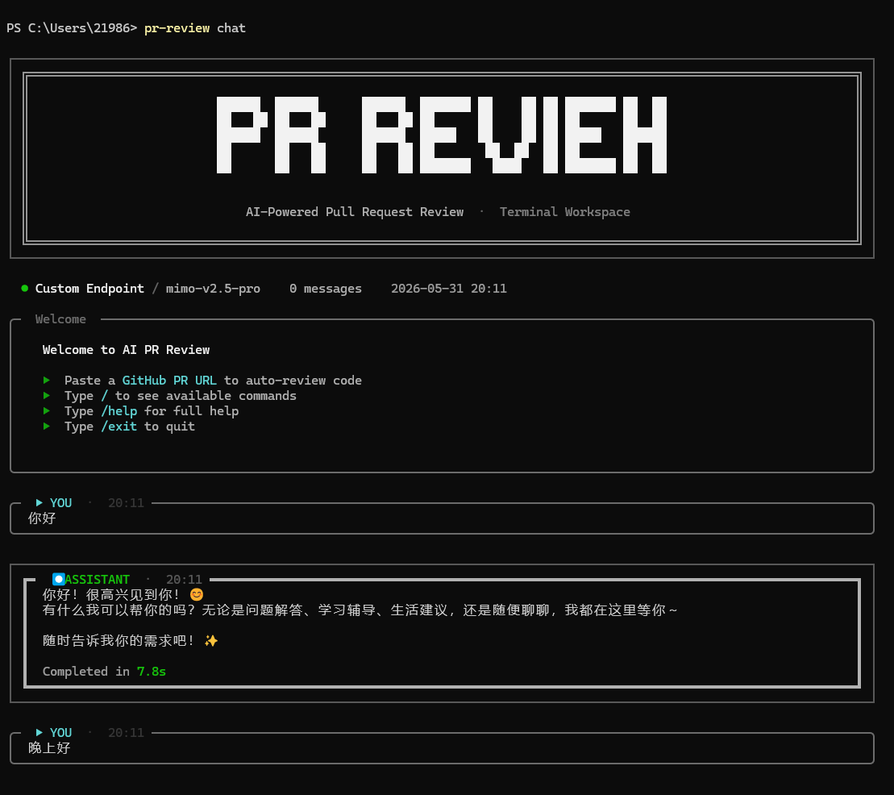
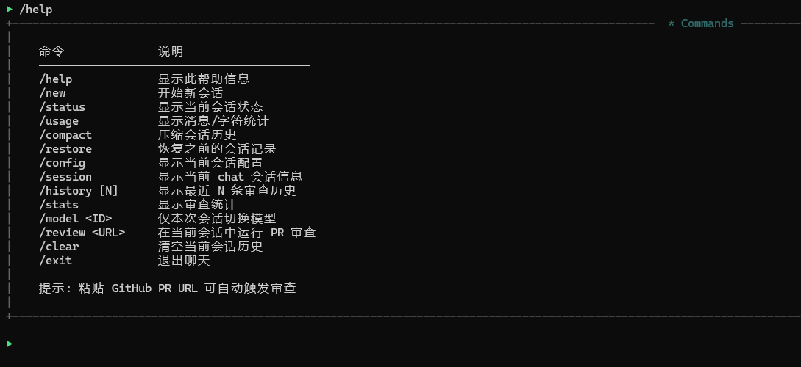
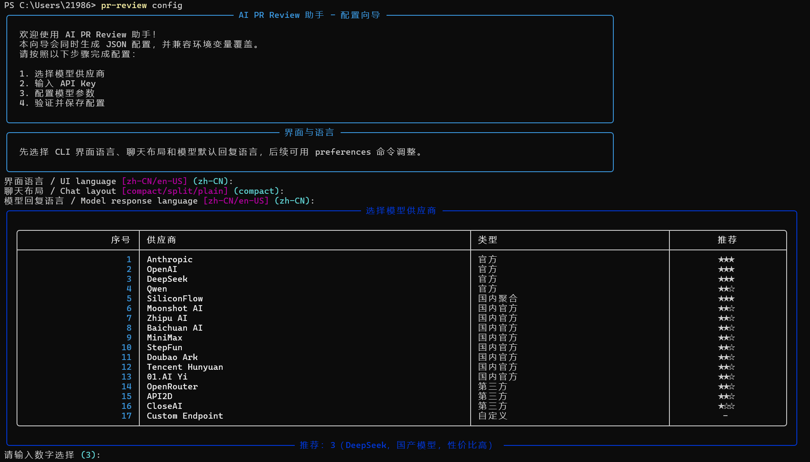
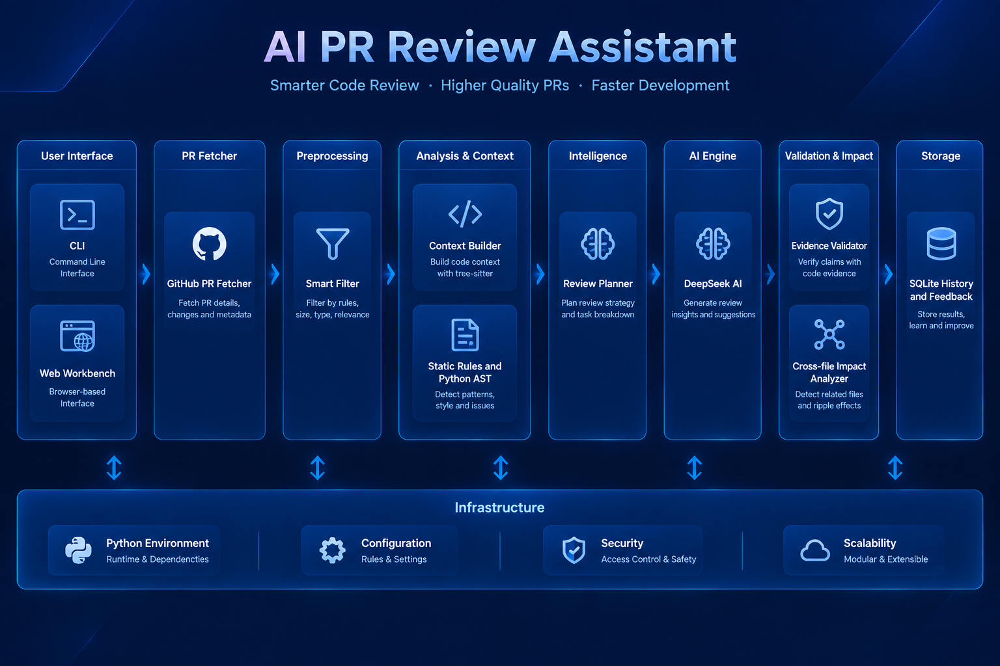
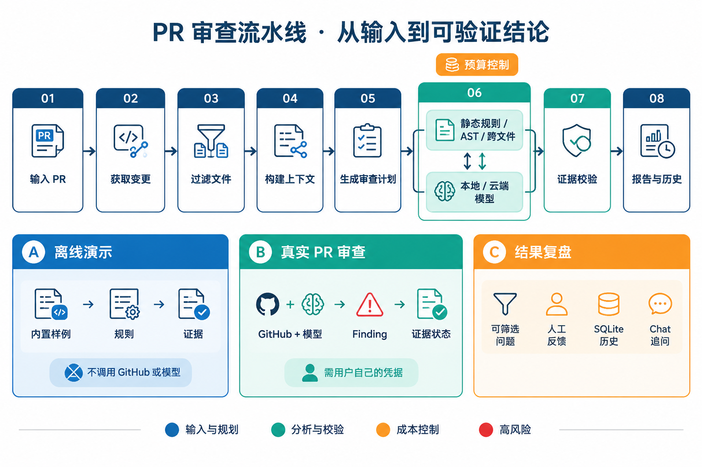

# AI PR Review Assistant

> AI 驱动的 GitHub Pull Request 代码审查 CLI 工具

[](https://www.python.org/)
[](LICENSE)
[]()
[]()

🌐 **[在线演示](https://jianglai999.github.io/AI-PR-Review-Assistant-web/)** | 📖 **[完整文档](docs/PROJECT_DESIGN.md)** | 💡 **[创新点](docs/INNOVATION.md)**

🎬 **视频演示：** [抖音](https://v.douyin.com/wBSy8yxLcEg/) | [哔哩哔哩](https://www.bilibili.com/video/BV1v9VZ6bE2G/?share_source=copy_web&vd_source=96df5919ae9bf8f3dc432bc3085a328f)

---

## 项目简介

AI PR Review Assistant 是一个基于 AI 的代码审查工具，通过智能分析 GitHub Pull Request 变更，自动发现潜在问题，帮助开发者提升代码审查效率与质量。

### 核心特性

- 🤖 **多模型支持** — 支持 18+ 模型供应商（OpenAI、Anthropic、DeepSeek、Qwen 等）
- 🧭 **智能审查规划** — 根据 PR 意图、风险关键词和文件变更动态生成审查计划
- ✅ **证据验证** — 校验 finding 的文件、行号、Diff 关联和代码片段，标记可信度状态
- 🔍 **规则 + AI 分析** — 将确定性安全规则与 AI 推理结果合并，支持跨文件影响信号
- 🎯 **智能过滤** — 自动跳过测试、文档、配置等不相关文件
- 📊 **结构化输出** — 终端彩色、Markdown、JSON、GitHub PR 评论
- 💰 **成本控制** — 单次运行和 24 小时窗口双重预算限制
- 💬 **聊天工作区** — 交互式终端聊天，支持斜杠命令
- 📦 **一键安装** — pipx / pip / curl 多种安装方式

---

## 项目截图

### 配置向导



### PR 审查输出



### 聊天工作区



---

## 快速开始

### 安装

> ⚠️ 注意：PyPI 上的 `ai-pr-review` 是同名的其他项目，请从 GitHub 安装本项目。

```bash
# 方式 1：从 GitHub 安装（推荐）
pip install "git+https://github.com/JiangLai999/AI-PR-Review-Assistant.git"

# 方式 2：一行命令安装（Linux/macOS）
curl -fsSL https://raw.githubusercontent.com/JiangLai999/AI-PR-Review-Assistant/main/install.sh | sh

# 方式 3：一行命令安装（Windows PowerShell）
irm https://raw.githubusercontent.com/JiangLai999/AI-PR-Review-Assistant/main/install.ps1 | iex

# 方式 4：从源码安装
git clone https://github.com/JiangLai999/AI-PR-Review-Assistant.git
cd AI-PR-Review-Assistant
pip install -e .

# 可选：启用 tree-sitter 语法级上下文（Python / JS / TS）
pip install -e ".[ast]"
```

### 配置

```bash
# 启动交互式配置向导
pr-review config

# 快速配置
pr-review config --quick

# 查看当前配置
pr-review config show

# 测试配置有效性
pr-review config test

# 检查供应商健康状态
pr-review config health

# 发现可用模型
pr-review config models

# 切换默认模型
pr-review config model --name "模型名称"

# 预览审查计划（不调用 AI）
pr-review plan https://github.com/owner/repo/pull/123
```

### 使用

```bash
# 审查 PR
pr-review https://github.com/owner/repo/pull/123

# 指定模型审查
pr-review https://github.com/owner/repo/pull/123 --model gpt-4

# 输出为 Markdown 文件
pr-review https://github.com/owner/repo/pull/123 --format markdown --output report.md

# 发布为 GitHub PR 评论
pr-review https://github.com/owner/repo/pull/123 --publish-comment

# 干运行（不调用 AI）
pr-review https://github.com/owner/repo/pull/123 --dry-run

# 查看历史记录
pr-review history

# 查看统计信息
pr-review stats

# 记录人工反馈（用于误报/修复追踪）
pr-review feedback <run-id> <finding-id> --status accepted --note "确认问题"

# 离线演示规划、规则检查和证据验证
pr-review demo

# 输出比赛现场推荐演示路径
pr-review showcase
pr-review showcase --json-output

# 启动本地 Web 工作台
pr-review serve
```

---

## 参赛版架构与审查流水线

### 项目架构图



### 审查流水线图



## 审查流水线

```
PR URL
  │
  ▼
┌──────────────┐    ┌──────────────┐    ┌──────────────┐
│  PR Fetcher  │───▶│    Filter    │───▶│   Context    │
│  获取 PR 数据 │    │  智能过滤    │    │  构建上下文  │
└──────────────┘    └──────────────┘    └──────────────┘
                                               │
                                               ▼
┌──────────────┐    ┌──────────────┐    ┌──────────────┐
│    Post      │◀───│  AI Client   │◀───│   Prompt     │
│  Processor   │    │  调用 AI 模型 │    │  组装 Prompt │
└──────────────┘    └──────────────┘    └──────────────┘
       │
       ▼
┌──────────────┐    ┌──────────────┐
│ Result Store │    │   Report     │
│  持久化存储   │    │  渲染报告    │
└──────────────┘    └──────────────┘
```

---

## Chat 工作区

```bash
# 进入聊天模式
pr-review chat

# 单条消息
pr-review chat --message "帮我总结这个 PR 的审查重点"

# 临时切换模型
pr-review chat --model "gpt-4" --message "你好"
```

### 斜杠命令

| 命令 | 说明 |
|------|------|
| `/help` | 显示帮助信息 |
| `/status` | 显示会话状态 |
| `/usage` | 显示消息统计 |
| `/model <ID>` | 切换模型 |
| `/review <URL>` | 执行 PR 审查 |
| `/history [数量或 Run ID]` | 查看审查历史；带 Run ID 时把它载入为当前报告 |
| `/explain <run_id>` | 解释该 Run 的问题与证据，不调用模型 |
| `/feedback <run_id> <finding_id> <status>` | 记录 Finding 反馈 |
| `/publish [run_id] [--confirm]` | 先预览、确认后再发布审查评论到 GitHub |
| `/demo [case_key]` | 运行离线演示用例（`/demo list` 列出全部） |
| `/showcase` | 查看参赛演示路径，不改变项目状态 |
| `/stats` | 查看统计数据 |
| `/compact` | 压缩会话历史 |
| `/restore` | 恢复历史会话 |
| `/clear` | 清空当前会话 |
| `/exit` | 退出聊天 |

Chat 快捷键：`Ctrl+C` 在存在选区时复制到剪贴板；无选区时第一次提示、1.5 秒内再按一次退出；运行中按 `Ctrl+C` 取消当前任务。输入框内可用 `Ctrl+A` 全选。

Findings 详情：`Ctrl+O` 打开；没有 findings 时会提示先执行 `/review` 或 `/history <run_id>`。列表模式下 `↑↓` 选择、`←→` 翻页、`Ctrl/Alt+↑↓` 或 `PgUp/PgDn` 滚动详情；按 `Tab` 可把焦点切到详情，再用 `↑↓ / PgUp / PgDn / Home / End` 阅读完整问题、建议、证据和代码片段。

审查工作区（P5）：`Ctrl+F` 打开 Findings 筛选浮层，输入关键词实时过滤，`Tab` 切换严重级别、`Shift+Tab` 切换证据状态、`Ctrl+S` 切换排序，`Enter` 应用、`Esc` 清除并关闭。`Alt+P` 进入发布流程：先显示目标仓库、PR 编号、问题数与截断后的评论正文，只有再按一次 `Enter` 才会真正调用 GitHub API 发帖，`Esc` 取消且不写入任何内容。`Alt+D` 或 `/demo` 打开离线演示面板（不调用模型、不联网），`/showcase` 打开参赛演示路径。

Chat 内配置助手（`Ctrl+P` / `/setup`）为六段式：运行模式 → 模型服务与连接 → API Key / 本地模型 → 模型 → GitHub Token → 界面与输出偏好 → 确认保存。保存写入最高优先级私有配置，云端切换会保留远程槽与已保存 Key。

---

## 配置文件

配置文件位置：

- Windows：`%APPDATA%\ai-pr-review\config.json`（兼容旧版 `~/.ai_pr_review/config.json`）
- macOS / Linux：`~/.ai_pr_review/config.json`

项目级配置位于仓库根目录的 `.ai_pr_review/config.json`，私有覆盖配置位于 `.ai_pr_review/config.local.json`。

```json
{
  "provider": {
    "name": "custom",
    "display_name": "Custom Endpoint",
    "api_key": "sk-xxx",
    "base_url": "https://api.example.com/v1",
    "api_format": "openai",
    "default_model": "model-name"
  },
  "github_token": "ghp_xxx",
  "preferences": {
    "output_format": "terminal",
    "language": "zh-CN"
  },
  "ai_client": {
    "max_cost_per_run": 5.0,
    "max_cost_per_24h": 50.0
  }
}
```

### 配置加载与覆盖规则

配置文件按以下顺序加载，后加载的文件覆盖同名字段：

1. 用户级配置
2. 项目级配置 `.ai_pr_review/config.json`
3. 项目本地配置 `.ai_pr_review/config.local.json`

随后应用 `AI_PR_REVIEW_*` 和 `GITHUB_TOKEN` 环境变量覆盖。`--config <path>` 用于指定用户级配置文件路径，不会绕过环境变量覆盖。

> `hybrid_strategy`、`ui_language`、`chat_layout` 等属于个人偏好：在项目内通过 Chat / `pr-review config` 保存时，会写入最高优先级的 `.ai_pr_review/config.local.json`（私有且默认忽略），不会被项目共享的 `config.json` 重新覆盖。`pr-review config init` 生成的共享模板只包含 Provider 默认值，不再写个人偏好。

---

## 支持的模型供应商

| 供应商 | API 格式 | 说明 |
|--------|----------|------|
| OpenAI | openai | GPT 系列模型 |
| Anthropic | anthropic | Claude 系列模型 |
| DeepSeek | openai | DeepSeek 系列模型 |
| Qwen | openai | 通义千问系列 |
| SiliconFlow | openai | 硅基流动 |
| Moonshot | openai | 月之暗面 |
| Zhipu | openai | 智谱 AI |
| Baichuan | openai | 百川智能 |
| Minimax | openai | MiniMax |
| Stepfun | openai | 阶跃星辰 |
| Doubao | openai | 豆包 |
| Hunyuan | openai | 混元 |
| Yi | openai | 零一万物 |
| OpenRouter | openai | 多模型代理 |
| API2D | openai | 第三方代理 |
| CloseAI | openai | 第三方代理 |
| OhMyGPT | openai | 第三方代理 |
| Custom | openai | 自定义端点 |

---

## 技术栈

| 技术 | 用途 |
|------|------|
| Python 3.12+ | 主语言 |
| Click | CLI 框架 |
| Rich | 终端 UI |
| Pydantic | 数据验证 |
| PyGithub | GitHub API |
| Anthropic SDK | AI 模型调用 |
| AST 增强上下文 | Tree-sitter（可选，`pip install -e ".[ast]"`）→ 正则提取 → Diff 上下文降级 |
| Python AST 规则 | 标准库 `ast`，用于可变默认参数、裸异常等语法级检查 |
| SQLite | 本地存储 |
| React 18 + TypeScript | Web 工作台界面 |
| Vite 6 | 前端构建（产物随包分发） |
| GSAP | 官网展示页动画 |

> Web 工作台的前端构建产物已随包提交在 `src/ai_pr_review/web_static/`，
> 因此 `pip install` 之后**无需 Node** 即可用 `pr-review serve` 打开完整界面。
> 只有修改前端源码时才需要 Node。

---

## 项目结构

```
AI-PR-Review-Assistant/
├── src/ai_pr_review/
│   ├── cli.py                    # CLI 入口
│   ├── config.py                 # 配置管理
│   ├── config_wizard.py          # 配置向导
│   ├── chat_commands.py          # 聊天命令
│   ├── chat_runtime.py           # 聊天引擎
│   ├── web_server.py             # 本地 Web 服务端（标准库）
│   ├── web_static/               # Web 工作台构建产物（随包分发，无需 Node）
│   ├── models/
│   │   ├── pr_data.py            # PR 数据模型
│   │   └── review_plan.py        # 审查计划 / 证据 / 接口变更模型
│   ├── benchmark/                # 基准测试体系
│   │   ├── cases.py              # 已知缺陷样例库
│   │   ├── models.py             # 指标与报告模型
│   │   └── runner.py             # 评测执行器
│   ├── services/
│   │   ├── pr_fetcher.py         # PR 获取
│   │   ├── filter_pipeline.py    # 文件过滤
│   │   ├── context_builder.py    # 上下文构建（三级降级）
│   │   ├── prompt_assembler.py   # Prompt 组装
│   │   ├── ai_client.py          # AI 调用
│   │   ├── post_processor.py     # 后处理
│   │   ├── report_renderer.py    # 报告渲染
│   │   ├── result_store.py       # 结果存储
│   │   ├── review_orchestrator.py# 编排层
│   │   ├── cost_controller.py    # 成本控制
│   │   ├── agent/
│   │   │   └── planner.py        # 确定性审查规划
│   │   ├── analyzers/
│   │   │   ├── static_analyzer.py      # 逐行安全规则
│   │   │   ├── python_ast_analyzer.py  # Python AST 规则
│   │   │   ├── symbol_index.py         # 跨文件符号索引
│   │   │   ├── cross_file_interface.py # 接口影响分析
│   │   │   ├── cross_file_analyzer.py  # 轻量关系信号
│   │   │   └── finding_merge.py        # 结果去重合并
│   │   ├── evidence/
│   │   │   └── finding_validator.py    # 证据校验
│   │   └── model_providers/      # 多供应商适配
│   └── utils/
│       └── github_url_parser.py  # URL 解析
├── tests/                        # 测试套件
├── docs/                         # 文档
│   ├── PROJECT_DESIGN.md         # 项目设计书
│   ├── INNOVATION.md             # 创新点文档
│   ├── API.md                    # API 文档
│   └── RELEASE.md                # 发布说明
├── website/                      # 前端展示页面（官网，纯静态）
│   ├── index.html
│   ├── css/style.css
│   └── js/main.js
├── web/                          # Web 工作台前端源码（React + Vite）
│   ├── src/
│   │   ├── api/                  # 接口客户端与类型契约
│   │   ├── components/           # 组件与设计体系
│   │   ├── pages/                # 概览 / 审查 / 历史 / 准确率 / 接口
│   │   └── styles/               # DSH 设计令牌与组件样式
│   ├── index.html
│   ├── package.json
│   └── vite.config.ts
├── pyproject.toml                # 包配置
├── README.md                     # 本文件
├── CHANGELOG.md                  # 变更日志
├── CONTRIBUTING.md               # 贡献指南
└── LICENSE                       # MIT 许可证
```

---

## 智能审查增强

完整审查现在会生成透明的 `ReviewPlan`，并在模型结果之后执行：

- 静态安全规则检查（动态执行、HTML 注入、硬编码凭证、SQL 插值等）
- Python AST 规则（可变默认参数、裸 except、`is` 字面量比较、未关闭资源、
  危险反序列化、`shell=True`、关闭 TLS 校验、弱哈希、异常链丢失等）
- Finding 证据验证（文件、行号、变更行、代码片段）
- 跨文件符号级接口影响分析（签名对比 + 外部调用方定位）
- 并发安全的 AI 预算预留
- SQLite 中的 Finding 人工反馈记录

可以先使用 `pr-review plan <PR_URL>` 查看审查范围，再执行完整审查。

### Web 工作台

```bash
pr-review serve            # 默认 http://127.0.0.1:8787
```

界面包含五个视图：

| 视图 | 内容 |
|------|------|
| **概览** | 产品定位、审查流水线八步、关键能力、实时统计数据、基准准确率 |
| **审查工作台** | PR 链接输入、计划/完整审查、风险总览指标、审查计划、证据校验、文件过滤、跨文件接口影响、可筛选 Findings、人工反馈、原始 JSON |
| **历史审查** | 运行记录表、聚合统计、按运行 ID 载入完整报告 |
| **准确率** | 三种策略对比、混淆矩阵、逐样例指标 |
| **接口** | 全部 HTTP 接口与 CLI 命令参考、运行边界说明 |

前端为 React + Vite 应用，**构建产物随包分发**，因此普通用户无需 Node：

```bash
# 仅修改前端源码时才需要
cd web && npm install && npm run build   # 输出到 src/ai_pr_review/web_static/
```

### 三级上下文降级

```
Level 1: tree-sitter 语法树（需安装可选依赖 ".[ast]"）
Level 2: 正则提取
Level 3: 仅 diff 上下文
```

未安装 tree-sitter 时自动降级到正则，不影响运行。

### 基准测试

内置已知缺陷样例库，用于量化分析策略并防止规则退化：

```bash
pr-review benchmark                  # 默认 combined 策略
pr-review benchmark --strategy all   # 横向比较 static / ast / combined
pr-review benchmark --json-output    # 完整 JSON 明细
```

当前样例库（4 个样例、12 处已知缺陷、1 个对照组）在 `combined` 策略下的
实测结果为 Precision 1.00 / Recall 1.00 / Line accuracy 1.00。

> 这是**精选回归样例集**的成绩，用于保证规则不退化、误报不增加，
> 不等同于在真实 PR 上的泛化准确率。

## 测试与质量

```bash
# 运行测试
pytest

# 代码格式化检查
black --check src tests

# 导入排序检查
isort --check-only src tests

# 类型检查
mypy src
```

### 测试覆盖率

以下测试数按 `pytest --collect-only` 统计，覆盖率为 `pytest --cov` 实测结果。

| 模块 | 测试数 | 说明 |
|------|--------|------|
| CLI | 54 | 命令入口、报告渲染、聊天斜杠命令 |
| PR Fetcher | 48 | 分页、限流、错误分类 |
| Filter Pipeline | 14 | 黑白名单、过滤原因 |
| Context Builder | 9 | tree-sitter / 正则 / 降级三态 |
| Python AST Analyzer | 18 | 可变默认参数、裸异常、资源泄漏等 |
| Cross-file Interface | 17 | 符号索引、签名对比、外部引用 |
| Benchmark | 25 | 指标计算、样例库、回归保护 |
| Web Server | 23 | HTTP 接口、错误码、反馈写入 |
| PR Fetcher / AI Client | 12 | 重试、成本、JSON 解析 |
| Prompt Assembler | 6 | 双层 prompt、schema |
| Post Processor | 5 | 置信度、去重、排序 |
| Cost Controller | 6 | 单次与 24 小时预算 |
| Result Store | 6 | 持久化、元数据、反馈 |
| Report Renderer | 6 | 四种输出格式 |
| Model Providers | 8 | 供应商适配 |
| Review Orchestrator | 2 | 并发、空过滤摘要 |
| **总计** | **270** | 全量通过，覆盖率 87% |
